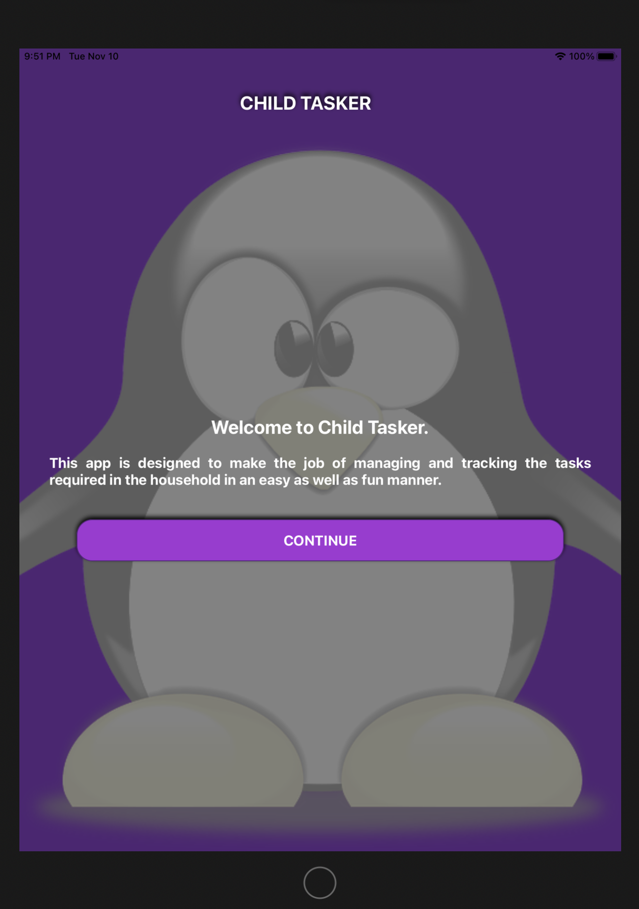
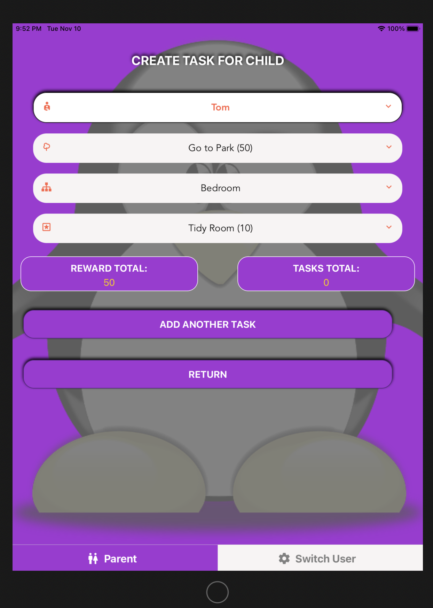
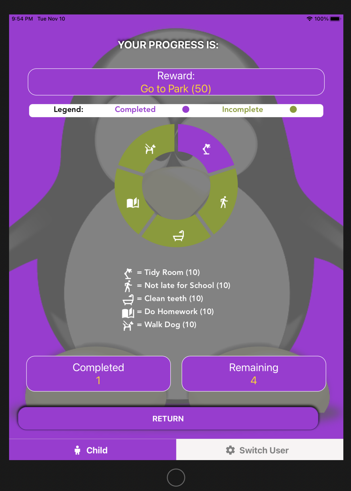

## Table of contents

-   [General info](#general-info)
-   [Download](#download)
-   [ChildTasker Link](#ChlidTasker-link)
-   [Key Functions](#key-functions)
-   [To Do or Future Items](#Future-Items)
-   [Screenshots](#screenshots)
-   [In-depth Features of Child Tasker](#in-depth-features-of-Child-Tasker)
-   [Challenges](#challenges)
-   [Technologies Used](#technologies-used)
-   [Approach Taken](#approach-taken)

## General info

This application to demonstrate both client side and Server side technologies to encapsulate the following key ideas:

-   an application to source a RESTFUL api and store job adverts in a database.
-   Jobs will focus on IT/Software Devloper roles.
-   a user to register/login and view jobs.
-   a user to save jobs that they will apply for
-   a user to see all saved jobs, track what they have applied for.

## Download

Download via:

-   https://github.com/mistergjones/ChildTasker.git

## Key Functions

-   A parent can register a child / children in this application, establish rewards and assign tasks to their child for completion.
-   A child can login on the device and complete their assigned tasks.
-   Once achieved, the child can them claim the assigned reward.
-   A Parent can also registger their spouse/partner on the same device and manage their children's login details.

## Future-Items

The following possible features could be included in other iterations:

-

## Screenshots

## In-depth Features of Child Tasker

-   put some thing here

## Challenges

-   put something here

## Approach Taken

Given this was a group delivered, we treated it like an Agile project:

-   Developed an initial Scope document that included an overall scope, a product feature breakdown and indicative database design.
-   Twice daily stand-up sessions occured to agree on features to be developed next along with supporting each other.
-   Frequent commits and rebasing of the code occured to ensure all project members had the latest build.

## Technologies Used

Project is created with:

Frontend:

1. React Native

Database:

1. SQLite

3rd Party:

1. Formik
2. Yup
3. Expo

Released on:

1. Google Play Store (Android)
2. Apple Store (IOS)

Version Control:

1. Git
